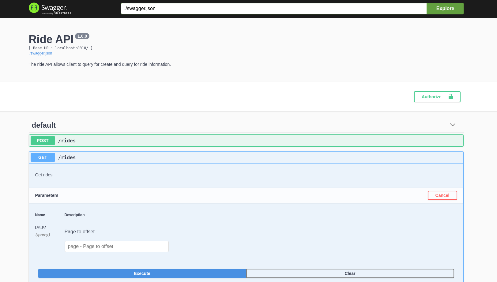

# Coding Exercise - Rides API

[](https://circleci.com/gh/yehjxraymond/backend-coding-test)

[](https://sonarcloud.io/dashboard?id=yehjxraymond_backend-coding-test) [](https://sonarcloud.io/dashboard?id=yehjxraymond_backend-coding-test)

[](https://sonarcloud.io/dashboard?id=yehjxraymond_backend-coding-test) [](https://sonarcloud.io/dashboard?id=yehjxraymond_backend-coding-test) [](https://sonarcloud.io/dashboard?id=yehjxraymond_backend-coding-test)

## Introduction

This repository holds the code for the backend of the Rides application. The application exposes several APIs for frontend clients to easily query and create new ride information.

## Setup

```sh
git clone https://github.com/yehjxraymond/backend-coding-test.git
npm i
```

### Starting the Server (production build)

```sh
npm run build
npm run start
```

### API Documentation (with Swagger)



To understand and interact with the API with Swagger, run the following commands (your API must be running separately):

```sh
npm run swagger:server
open http://localhost:8080
```

### Running Tests

Below commands runs unit test, integration test and code lint respectively.

```sh
npm run test
npm run test:integration
npm run lint
```

### Development

For hot reloading and faster development environment, run the following to start the dev server:

```sh
npm run dev
```
