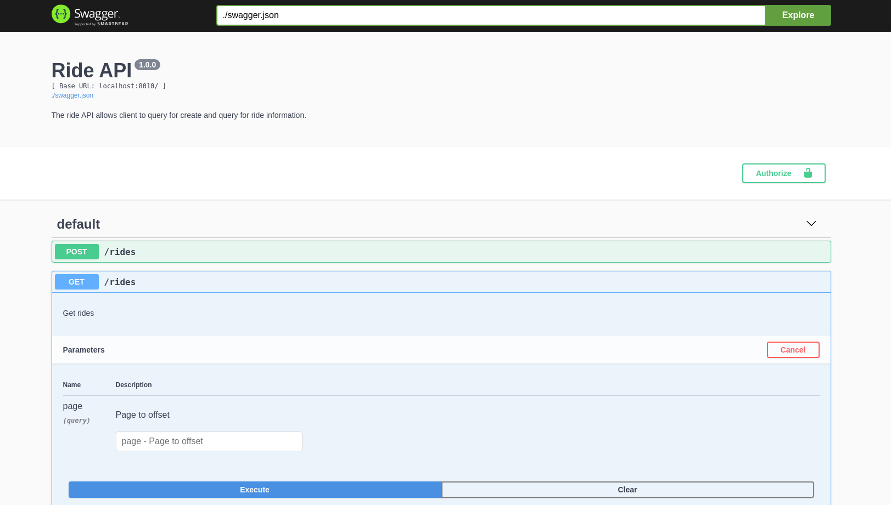

# Opinions

## Typescript

Typescript is a gift that keeps giving. Seeing that the code base is in the infancy stage, it is best to get started with migrating it to typescript. For that reason, it is the first thing I chose to work on.

## Dev Feedback Loop

To keep the feedback loop really short, `nodemon` is used in conjunction with `ts-node` to keep the dev server running. The choice of ts-node was because it is much faster than waiting for `tsc` to build and the server to start.

Use `npm run dev` to get the server running in the dev mode where it watches for changes in the src directory and reruns the server.

## Different Types of Testing

To keep the feedback loop for developers short, unit test should be plenty and it should run without the server actually running. To do that we will need to separate integration test from unit tests and run them separately.

Finally, load test should be kept separately from the integration or unit test as it's purpose is not to test for implementation correctness.

`npm run test` to run unit test
`npm run test:watch` to run unit test in watch mode
`npm run test:integration` to run integration test

## Handler Boundary

With a handler boundary to handle `res.send`, depending if the handler returns a result in a successful call or throws an error during an unsuccessful call, will allow developers writing functions to focus on the matter at hand. That is to implement the function correctly without concerns about the request/response layer of the application.

Compared to previous implementations, we can now throw an error immediately to terminate the function flow and there will be no risk of not returning the function after res.send, causing subsequent statements to execute.

## DB as a Service

The DB object does not have to be passed around from the initialization stage to the handler functions. Rather, it can be exposed as a service to the different handlers directly without being passed around as an argument.

One may argue that testing will be easier when DB is passed in as an object using dependency injection, but with mocks, the same can be achieved easily.

## Test setup

Mocha + NYC + Chai + Chai-as-expected + Sinon = Jest

If given the ability to choose the test runner, I will pretty much prefer Jest as it requires very little setup. Aside from that it has expect and code coverage out of the box. The cherry on top will be it's CLI which allows a developer to run various subset of tests, for instance:

- only changed files since last commit
- regex filter on files to run

Considering that the tools doesn't have high cohesion with one another, it results in high setup cost, or fats, that is involved in writing test. This is one way to make developers hate to write tests.

One such example is when doing basic stubbing, one has to:

- setup chai
- setup stub
- teardown sinon sandbox

If the developer forgets to run the test in describe scope, the one test file might affect the results of another test file.

## Automatic input validation message

Looking at the endpoint we can see how verbose the validation can get. Using hapi's Joi framework for validation, we can simply create the schema for the object and allow the assert method to throw or the validator to return the error message.

This is especially useful considering that developers tend to copy and paste error messages, as shown in the base code provided. These erroneous error message won't be as useful if they are not reflective of the problem at hand.

## Inconsistent client-side data representation

When POST-ing a ride information, the keys for the ride information is using underscores, when the server returns the value, it is using camelCase. This is an example of a poorly developed API. The API forms the contract between the frontend and backend and must be standardized before the first line of code is written on either ends. Again I've wrote about this in my blog on Agility Under Uncertainty.

For this reason, I've changed all the representations to camelCase considering that the database is already storing it in camelCase and the frontend developer is likely a javascript developer as well (Python developers will likely prefer camel case on the other hand).

## SonarQube

SonarQube has been configured for this project to show how the team can use it to perform quality gate enforcement before final merge to master branch.

The analysis is available publicly and can be accessed at https://sonarcloud.io/dashboard?id=yehjxraymond_backend-coding-test

## Additional Security Measures

CORS and Helmet are two low hanging fruits that helps protect the client (we are assuming web client). CORS helps to restrict access from other domain names while Helmet enforces several other protection such as using HTST, frameguard etc. More details about Helmet found [here](https://helmetjs.github.io/).

## Code as Documentation

Well-written code documents itself. A developer should strive to write simple modular code which describes what exactly he is trying to do. Good code reads like a prose without a need to describe it with another separate document.



In addition, developers hate to write and update documentation. As much as possible documentation should be generated from code itself. In this case, I've chosen to generate a Swagger API Documentation that not only a developer is able to read and understand what it is trying to do, a developer can play and interact with the API from the documentation itself!

To set up the swagger API spec:

```sh
npm run swagger:server
open http://localhost:8080
```

## Load Testing (Fuzzing vs Load Test on Dev Env)

Load testing as a mean for fuzzing out potential errors in the logic under stress makes sense. However, the intention should not be to get an idea of how the application is performing. Depending on developer's machine's specifications, the load testing report varies largely and does not reflect how the production application will perform.

Artillery has a plugin for just this type of testing, see https://github.com/artilleryio/artillery-plugin-fuzzer

## Trapping Background Task

Unix has a simple way to background an application by appending `&` to the script execution.

To start and stop an application, one can use a trap to kill running application.

Detailed documentation on how this can be done can be found https://spin.atomicobject.com/2017/08/24/start-stop-bash-background-process/

## On "Hosting Documentation"

The documentation can be written easily with a markdown file. On committing, it is hosted and rendered without the need for additional processing.

To turn that into a webpage, github pages can be used.
